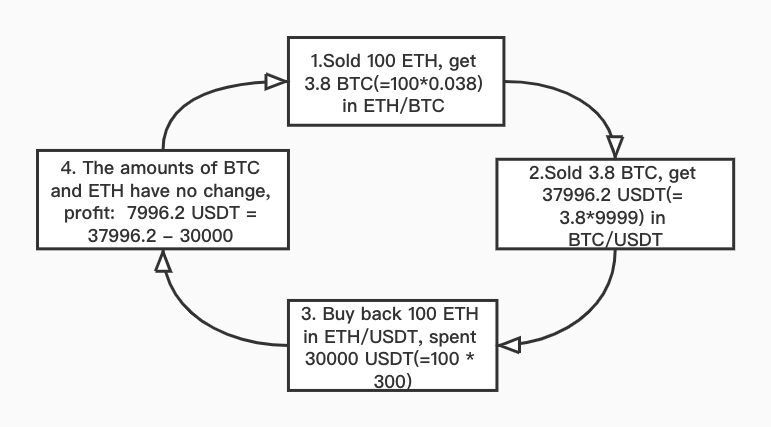

# Triangular_arbitrage

## Strategy description

**Triangular arbitrage** (also referred to as **cross currency arbitrage** or **three-point arbitrage**) is the act of exploiting an arbitrage opportunity resulting from a pricing discrepancy among three different currencies in the foreign exchange market.

**A triangular arbitrage strategy involves three currencies. In theory, if we have very low latency ordering platform with low bid-ask spread, the arbitrageur could lock in a zero-risk profit from the discrepancy between the market cross exchange rate is not aligned with the synthetic cross rate.**

Triangular arbitrage also applys to the digital currency market. In general, the exchange rates between digital currencies are related to their prices in dollars. However, due to the strong volatility of the digital currency market, in some exchanges with illiquidity and market impact, **the market price could be temporarily deviated from the  synthetic cross price. **When the profit from the deviation could offset the cost of trading, we could lock in a zero-risk profit by triangular arbitrage.

**Applications**: After an inequality exists between the market cross rate caused by the different fluctuations of different trading targets when the market has large fluctuations.

**e.g.** : There are three trading pairs in the spot market **with no trading fee**: BTC / USDT, ETH / USDT, ETH / BTC .  

BTC/USDT: bid price = 9999 USDT, ask price =  10000 USDT,  

ETH/USDT: bid price = 299 USDT, ask price =  300 USDT,  

ETH/BTC: bid price = 0.029901BTC, ask price = 0.03001 BTC. 

The synthetic cross price of ETH/BTC: bid price = 0.029902 BTC, ask price = 0.03000 BTC, calculated by the market prices of BTC/USDT and ETH/USDT which is almost identical with the market price of ETH/BTC.

If the **market price of ETH/BTC** fluctuates at a certain momen:   

**bid price = 0.03800 BTC, ask price = 0.03900 BTC**.

 

**Advantages**：  

1. Lesser impacts from the price fluctuation of the transaction target,  

2. No possibility of large loss caused by drastic market changes,  

3. Low overall risk.

**Disadvantages**：  

1. Price slippage casued by the changes of orderbook,
2. The cost of trading fee,
3. There may be a risk that the arbitrage is not converted into a stable currency in time, and the price of the currency held will cause a loss,
4. Major impact from the latency of transaction data and the order match system.

**Moreover, KuCoin provides the transaction data of level 3, great matching engine, and the commission discount specially offers to the API customers, which could greatly reduce the disadvantages of the trading operations. At the same time, we offer the sandbox environment as the data testing support to avoid the risks. **

**Notice: If you want to use the strategy in the actual environment to earn stable profits, we hope that you can make test adjustments in the sandbox environment with other parameters or strategies to enable you to achieve your goals. We also look forward to sharing your test data and Insights.**

**Surely, if you encounter any problems in this process, or you have a profitable strategy to share, please reflect in ISSUE, we will try to respond in a timely manner.**

